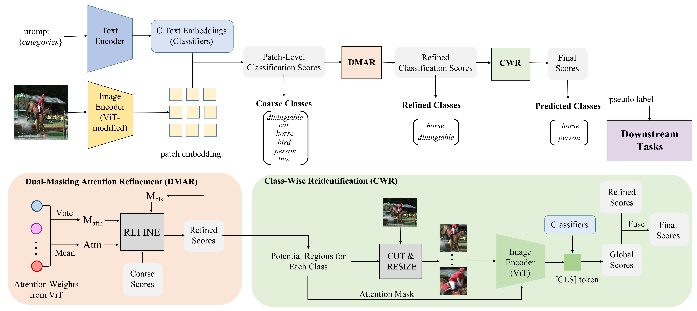

[](https://paperswithcode.com/sota/unsupervised-semantic-segmentation-with-11?p=tagclip-a-local-to-global-framework-to)
[](https://paperswithcode.com/sota/unsupervised-semantic-segmentation-with-10?p=tagclip-a-local-to-global-framework-to)
[](https://paperswithcode.com/sota/unsupervised-semantic-segmentation-with-1?p=tagclip-a-local-to-global-framework-to)
# TagCLIP: A Local-to-Global Framework to Enhance Open-Vocabulary Multi-Label Classification of CLIP Without Training (AAAI 2024)
:closed_book: [[arxiv paper]](https://arxiv.org/abs/2312.12828)


## Reqirements

```
# create conda env
conda create -n tagclip python=3.9
conda activate tagclip

# install packages
pip install torch==1.9.0+cu111 torchvision==0.10.0+cu111 -f https://download.pytorch.org/whl/torch_stable.html
pip install opencv-python ftfy regex tqdm ttach lxml
```

## Preparing Datasets
Download each dataset from the official website ([PASCAL VOC 2007](http://host.robots.ox.ac.uk/pascal/VOC/voc2007/), [PASCAL VOC 2012](http://host.robots.ox.ac.uk/pascal/VOC/voc2012/), [COCO 2014](https://cocodataset.org/#download), [COCO 2017](https://cocodataset.org/#download)) and put them under local directory like `/local_root/datasets`.
The structure of `/local_root/datasets/`can be organized as follows:
```
---VOC2007/
       --Annotations
       --ImageSets
       --JPEGImages
---VOC2012/   # similar to VOC2007
       --Annotations
       --ImageSets
       --JPEGImages
       --SegmentationClass
---COCO2014/
       --train2014  # optional, not used in TagCLIP
       --val2014
---COCO2017/
       --train2017  # optional, not used in TagCLIP
       --val2017
       --SegmentationClass
---cocostuff/
       --SegmentationClass
```
Note that we use VOC 2007 and COCO 2014 for multi-label classification evaluation. VOC 2012 and COCO 2017 are adopted for annotation-free semantic segmentation (classify then segment). The processed `SegmentationClass` for [COCO 2017](https://drive.google.com/file/d/1LUEVI62pFHAVJag1MDV5b-Vica2KcUlV/view?usp=drive_link) and [cocostuff](https://drive.google.com/file/d/1nQtOso9JIIdDnqjma34vm9vQo7dPe6DU/view?usp=drive_link) are provided in Google Drive.

### Preparing pre-trained model
Download CLIP pre-trained [ViT-B/16](https://openaipublic.azureedge.net/clip/models/5806e77cd80f8b59890b7e101eabd078d9fb84e6937f9e85e4ecb61988df416f/ViT-B-16.pt) and put it to `/local_root/pretrained_models/clip`.

## Usage
### Multi-Label Classification.
```
# For VOC2007
python classify.py --img_root /local_root/datasets/VOC2007/JPEGImages/ --split_file ./imageset/voc2007/test_cls.txt --model_path /local_root/pretrained_models/clip/ViT-B-16.pt --dataset voc2007

# For COCO14
python classify.py --img_root /local_root/datasets/COCO2014/val2014/ --split_file ./imageset/coco2014/val_cls.txt --model_path /local_root/pretrained_models/clip/ViT-B-16.pt --dataset coco2014
```


### Annotation-free Semantic Segmentation
By combing TagCLIP and weakly supervised semantic segmentation (WSSS) method [CLIP-ES](https://github.com/linyq2117/CLIP-ES), we can realize annotation-free semantic segmentation.

First generate category labels for each image using TagCLIP, which will be saved in `./output/{args.dataset}_val_tagclip.txt`. We also give our generated labels as `./output/{args.dataset}_val_tagclip_example.txt` for reference.
```
# For VOC2012
python classify.py --img_root /local_root/datasets/VOC2012/JPEGImages/ --split_file ./imageset/voc2012/val.txt --model_path /local_root/pretrained_models/clip/ViT-B-16.pt --dataset voc2012 --save_file

# For COCO17
python classify.py --img_root /local_root/datasets/COCO2017/val2017/ --split_file ./imageset/coco2017/val.txt --model_path /local_root/pretrained_models/clip/ViT-B-16.pt --dataset coco2017 --save_file

# For cocostuff
python classify.py --img_root /local_root/datasets/COCO2017/val2017/ --split_file ./imageset/cocostuff/val.txt --model_path /local_root/pretrained_models/clip/ViT-B-16.pt --dataset cocostuff --save_file
```

Then use CLIP-ES to geberate and evaluate segmentation masks.

```
cd CLIP-ES

# For VOC2012
python generate_cams_voc.py --img_root /local_root/datasets/VOC2012/JPEGImages --split_file ../output/voc2012_val_tagclip.txt --model /local_root/pretrained_models/clip/ViT-B-16.pt --cam_out_dir ./output/voc2012/val/tagclip
python eval_cam.py --cam_out_dir ./output/voc2012/val/tagclip/ --cam_type attn_highres --gt_root /local_root/datasets/VOC2012/SegmentationClass --split_file ../imageset/voc2012/val.txt

# For COCO17
python generate_cams_coco.py --img_root /local_root/datasets/COCO2017/val2017/ --split_file ../output/coco2017_val_tagclip.txt --model /local_root/pretrained_models/clip/ViT-B-16.pt --cam_out_dir ./output/coco2017/val/tagclip
python eval_cam.py --cam_out_dir ./output/coco2017/val/tagclip/ --cam_type attn_highres --gt_root /local_root/datasets/COCO2017/SegmentationClass --split_file ../imageset/coco2017/val.txt

# For cocostuff
python generate_cams_cocostuff.py --img_root /local_root/datasets/COCO2017/val2017/ --split_file ../output/cocostuff_val_tagclip.txt --model /local_root/pretrained_models/clip/ViT-B-16.pt --cam_out_dir ./output/cocostuff/val/tagclip
python eval_cam_cocostuff.py --cam_out_dir ./output/cocostuff/val/tagclip/ --cam_type attn_highres --gt_root /local_root/datasets/cocostuff/SegmentationClass/val --split_file ../imageset/cocostuff/val.txt
```

### Use CRF to postprocess
```
# install dense CRF
pip install --force-reinstall cython==0.29.36
pip install joblib
pip install --no-build-isolation git+https://github.com/lucasb-eyer/pydensecrf.git

# eval CRF processed pseudo masks
## for VOC12 
python eval_cam_with_crf.py --cam_out_dir ./output/voc2012/val/tagclip/ --gt_root /local_root/datasets/VOC2012/SegmentationClass --image_root /local_root/datasets/VOC2012/JPEGImages --split_file ../imageset/voc2012/val.txt --eval_only

## for COCO14
python eval_cam_with_crf.py --cam_out_dir ./output/coco2017/val/tagclip/ --gt_root /local_root/datasets/COCO2017/SegmentationClass --image_root /local_root/datasets/COCO2017/val2017 --split_file ../imageset/coco2017/val.txt --eval_only

## for cocostuff
python eval_cam_with_crf_cocostuff.py --cam_out_dir ./output/cocostuff/val/tagclip/ --gt_root /local_root/datasets/cocostuff/SegmentationClass/val --image_root /local_root/datasets/COCO2017/val2017 --split_file ../imageset/cocostuff/val.txt --eval_only

```

## Results
### Multi-label Classification (mAP)
| Method | VOC2007 | COCO2014 |
| --- | --- | --- | 
| TagCLIP (paper) | 92.8 | 68.8 |
| TagCLIP (this repo) | 92.8 | 68.7 |
### Annotation-free semantic Segmentation (mIoU)
| Method | VOC2012 | COCO2014 | cocostuff |
| --- | --- | --- | --- |
| CLS-SEG (paper) | 64.8 | 34.0 | 30.1 |
| CLS-SEG+CRF (paper) | 68.7 | 35.3 | 31.0
| CLS-SEG (this repo) | 64.7 | 34.0 | 30.3 |
| CLS-SEG+CRF (this repo) | 68.6 | 35.2 | 31.1

 
## Acknowledgement
We borrowed partial codes from [CLIP](https://github.com/openai/CLIP), [pytorch_grad_cam](https://github.com/jacobgil/pytorch-grad-cam/tree/61e9babae8600351b02b6e90864e4807f44f2d4a), [CLIP-ES](https://github.com/linyq2117/CLIP-ES) and [CLIP_Surgery](https://github.com/xmed-lab/CLIP_Surgery). Thanks for their wonderful works.

## Citation
If you find this project helpful for your research, please consider citing the following BibTeX entry.
```
@misc{lin2023tagclip,
      title={TagCLIP: A Local-to-Global Framework to Enhance Open-Vocabulary Multi-Label Classification of CLIP Without Training}, 
      author={Yuqi Lin and Minghao Chen and Kaipeng Zhang and Hengjia Li and Mingming Li and Zheng Yang and Dongqin Lv and Binbin Lin and Haifeng Liu and Deng Cai},
      year={2023},
      eprint={2312.12828},
      archivePrefix={arXiv},
      primaryClass={cs.CV}
}
```